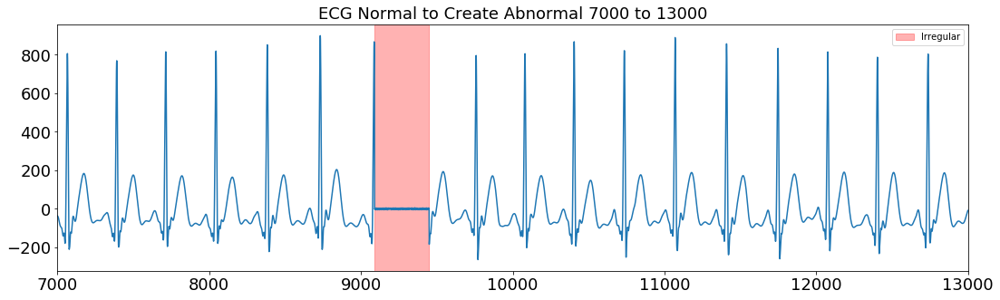

# ECG Anomaly Detection

### Introduction

The early detection and treatment of health issues is an important aspect in living longer. One of the main ways of early detection is through frequent medical checks which can help detect an early health complication. But sometimes, medical checks are not frequent enough to detect an issue before it progresses to an unhealthy state. Therefore, although not as thorough as an actual medical check conducted by professional doctors and nurses, by having a way to check even some indicators at home, one can have more control over their personal health.
Traditionally, the devices that people have at home that can be used to monitor their health status were limited to very basic functions such as a blood pressure cuff to measure blood pressure, a thermometer to measure temperature, a scale to measure weight, etc. Recently, with the advancement of wearable technology, it allows users at home to monitor more advanced metrics that were only feasible in a professional setting before. Devices such as the Apple Watch, blood glucose monitors, CPAP machines can be used to track your sleep patterns, exercise levels, blood sugar, etc.
An ElectroCardioGram, or ECG, is a major health status indicator for the heart. An ECG basically measures electrical signals from the heart. A healthy heart will have a regularity in the electric signal from the heart whereas an irregular signal might be an indicator to contact a doctor. The purpose of this project is to create a model that can detect an irregular electrical heart signal from the ECG data using a wearable device and highlight those irregular areas through a web application.

---

### Datasets
The data was gathered from one participant using Apple Watch. The normal ECG data was collected when the participant was sitting a chair at rest. The abnormal ECG data was collected when the participant was sitting a chair at rest but jolted sometimes since this participant does not have any problem for the ECG. Another normal data was gathered to create an abnormal data manually. Each data were sampled for 30 seconds with 511 Hz.

|Dataset|Type|Description|
|---|---|---|
|**ecg_normal.csv**|*float*| ECG from a participant sitting a chair at rest |
|**ecg_abnormal.csv**|*float*| ECG from a participant sitting a chair at rest but jolted sometimes |
|**normal_for_abnormal.csv**|*float*| ECG from a participant sitting a chair at rest (This is used for creating a test data) |

---

### EDA
Models were trained only using normal ECG data because there was not enough anomalous data. That is why models were unsupervised or self-supervised learning such as KNearst Neighbors, AR, and SSA. From the EDA, the training data was extracted from the normal data at an interval from 6000 to 12000. The testing data was also extracted from the abnormal data at an interval from 8000 to 14000 interval. In addtion, one more testing data was extrancted from 'normal_for_abnormal.csv' (which is corrupted manually for testing). The table below shows you the data dictionary.

|Dataset|Type|Description|
|---|---|---|
|**train.csv**|*float*| ECG from ecg_normal.csv at an interval from 6000 to 12000. |
|**test_01.csv**|*float*| ECG from ecg_abnormal.csv at an interval from 8000 to 14000. |
|**test_02.csv**|*float*| ECG from normal_for_abnormal.csv at an interval from 7000 to 13000 and manually corrupted in an interval. |

- The training data which has a regular and periodical pattern.

- The test_01 which contains irregular patterns at the red area.

- The test_02 which contains irregular patterns (manually corrupted) at the red area.

##### Therefore, the aim of modeling is to detect those anomaly ECG pattern.

---

### Model Comparison Direction
- The models will be created here calculate anomaly score on each data point in the time series. 
- There is not enough abnormal pattern data.
- Therefore, model comparison will be conducted manually if a model can detect anomaly which were defined in EDA.ipynb.
- If the data point is irregular, the anomaly socre goes up. I checked the defined area manually if the anomaly score time series have a clear peak compared to other time intervals for the model comparison.

---

### Modeling
- From the graphs, AR model is too sensitive for Test_01 and too dull for Test_02. 
- SSA (window:30, lag:50, ns_h:3) could detect Test_02 anomaly but could not well detect Test_01.
- It might not be good for data that have a lot of peaks. 
- KNN model (window:20) could detect Test01 and Test02 anomaly. And the peaks is clearer than the other models.
- Therefore, it is decided that KNN(window:20) is the best model to detect anomalous ECG this time. 
- The anomaly threshold for the app was decided at 0.18 from the best model graph.

- Best model (KNN)

- AR model

- SSA model

 
---

### Application
This app shows two potential use cases for the model. The first one is to identify anomalous areas in already collected ECG data. The second use case is to monitor ECG data in real-time. It is still in development but it is possible to use this model in real-time to detect anomalies.

App URL: https://ecg-checker.herokuapp.com/

---

### Conclusion
There are some limitations to the current project.  Firstly, there was not enough data collected. In addition, although the model is able to detect whether there is an anomaly or not, it is not able to detect what type of anomaly it is detecting, for example, an anomaly due to cardiac arrest, heart stroke, etc. This can be improved by gathering more data with labels and training additional models. Finally, if we can combine ECG data along with other biometrics, such as weight, age, etc., it can give us a more holistic insight into our health and allow us to take more preemptive measures at home.

---

### Sources

- Ide & Sugiyama (2015). Anomaly Detection and Change Detection, Machine Learning Professional Series.(https://ide-research.net/jpn/book/)
- [SSA Functions Source](https://qiita.com/s_katagiri/items/d46448018fe2058d47da)
